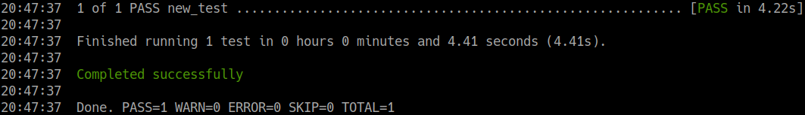
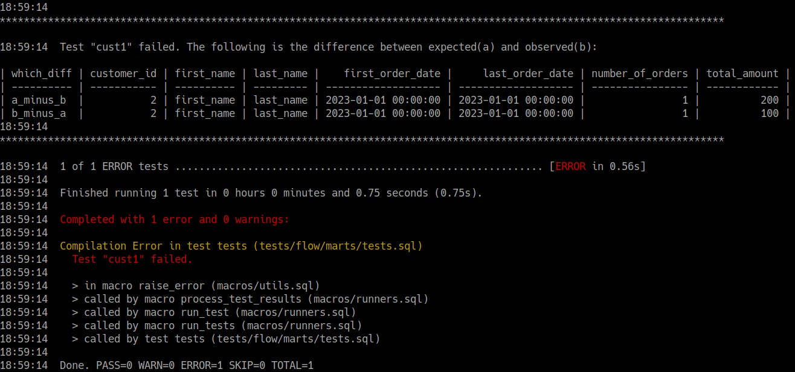

# dbt-flow

`dbt-flow` is a package that adds integration tests functionality for dbt.

`sources`, `tables` (incremental or not) and `seeds` can be mocked with customized data and then target nodes are compared against the expected.

In a nutshell, it's **unit-tests** for data transformations.

# Installation

Just add the following to your project `packages.yml`:

```yml
packages:
    - git: "https://github.com/WillianFuks/dbt-flow.git"
      revision: master
```

# Requirements

Python dependencies:

    - dbt-postgres==1.5.3
    - dbt-bigquery==1.5.3 (if using bigquery)

dbt-hub packages:

    - dbt_utils>=1.0.0
    - metrics==1.5.0

## Compatibility

- For now `Postgres` and `BigQuery` are officially supported. Adding new adapters should be straightforward, it's something we didn't have time yet to do.

# Documentation

`dbt-flow` was born out of a job rendered for a large company that required lots of business rules and fairly complex transformations. As it was necessary
to have some confirmation and quality control over the delivered data project, `dbt-flow` was first conceptualized then implemented to offer the extra guidance
on this regard.

Despite having being tested in production, the project is still in alpha development and is expected to be unstable in some
corner cases.

## How It Works

Simply define your code tests in the `test` folder of your dbt project. Here's an example of a test running for the model *customers* as defined
in *integration-tests/postgres/tests/flow/marts/tests.sql*:

```jinja
-- depends_on: {{ ref('dbt_metrics_default_calendar') }}
-- depends_on: {{ ref('stg__customers') }}
-- depends_on: {{ ref('stg__orders') }}
-- depends_on: {{ ref('int_payments_mapped') }}
-- depends_on: {{ ref('stg__payments') }}
-- depends_on: {{ ref('payments_mapping') }}

{{
    config(
        tags=['flow-test']
    )
}}


{%- set test1 = dbt_flow.setup_test(target_model='customers', test_name='cust1', options={"drop_tables": false}, test_description='simple flow test on customers node, without column "payment_method_name" in expected results.',
  mocks={
    "stg__orders": """
                   select 1 as order_id, 2 as customer_id, '2023-01-01'::Timestamp as order_date, 'statusB' as status
                   """,

    "stg__payments": """
                     select 1 as payment_id, 1 as order_id, 1 as payment_method_id, 100 as amount
                     """,

    "test_source_customers.test_customers": """
                                            select 2 as customer_id, 'first_name' as first_name, 'last_name' as last_name
                                            """,

    "payments_mapping": """
                        select 1 as payment_method_id, 'payment_method_A' as name union all
                        select 2 as payment_method_id, 'payment_method_B' as name
                        """
  },
  expected="""
    select
      2 as customer_id,
      'first_name' as first_name,
      'last_name' as last_name,
      '2023-01-01'::Timestamp as first_order_date,
      '2023-01-01'::Timestamp as last_order_date,
      1 as number_of_orders,
      100 as total_amount
  """
) -%}


{{ dbt_flow.run_tests([test1], global_options={"drop_tables": false}) }}
```

Let's break down each component of the test:

#### 1. Set Graph Dependencies

The first requirement in any `dbt_flow` test is to make explict all nodes that are dependencies of the target node being tested (*customers* in this example).

```jinja
-- depends_on: {{ ref('dbt_metrics_default_calendar') }}
-- depends_on: {{ ref('stg__customers') }}
-- depends_on: {{ ref('stg__orders') }}
-- depends_on: {{ ref('int_payments_mapped') }}
-- depends_on: {{ ref('stg__payments') }}
-- depends_on: {{ ref('payments_mapping') }}
```

This was an implementation decision to not take the route of mocking the macros `ref()` and `source()` because of the following:

1. By mocking `ref` and `source` the code becomes tightly coupled with the main runtime of dbt. If any bug or mistake is implemented in the mocks
that would affect production systems.

2. If dbt-core makes changes to the contracts of both `ref()` and `source()` that would prevent end users to upgrade their dbt version, which would
lead to a lock-in to the testing framework.

3. The mocking approach also hinges the possibility of mocking metric nodes as their `ref` function is defined in yamls.

4. Incremental tables cannot be tested solely with the mocked macros.

`dbt-flow` performs the tests by reading through the whole graph dependency as given by dbt and loops through each node and their dependencies, building
mocks when necessary. With this approach, all the above points are eliminated. But there are several downsides as well:

1. As show above, each node that is part of the test must be referenced at the beginning of the test (such as `-- depends_on: {{ ref('stg__customers') }}`). This
is so because `dbt-flow` loops through all dependency nodes and renders their raw sql code as defined in Jinja and dbt complains that it couldn't find previously
a reference to the node being rendered. That's why we need to make it explicit so dbt can see such dependencies at compile time.

2. All materializations must be customized. That is, tables and incremental tables must receive newer macros that replaces dbt's original materializaion ones. As it's
not possible to trigger those macros from the `test` task runtime that was the only way to properly mock the nodes and build them.

3. Each adapter must implement its own materialization strategies.

#### 2. Setup Each Test

Each test can be setup with the helper macro `dbt_flow.setup_test()`. Input parameters are:

* **target_model**: str, such as 'customers'. It represents the node that we want to test.

* **test_name**: str, it's an identifier of the test. This string is used as a suffix when creating the mocked tables in the database. For instance,
if `test_name=test1` then the mocked node "stg__customers" will be stored as "test1__stg__customers".

* **options**: Dict[str, bool], general options for how to run each specific test, such as whether to delete created tables aftewards or not. Available
options are:
  * verbose: bool, if `True` then prints information about this test.
  * test_incremental: bool, if `True` then the `is_incremental()` macro will be mocked as truthy and tables will be considered incremental.

* **test_description**: str, mainly for explaining what the current test is about. Intended for documentation purposes.

* **mocks**: Dict[str, str], one of the most important inputs, it specifies how nodes will be mocked through SQL queries. Keys must be the name
of the node being tested (just as in their filenames) or, for source nodes, it must be the name of the source combined with the name of the table
inside that source by a dot (`'.'`). For instance, here's how the node "stg__orders" is mocked for postgres adapter:

      "stg__orders": """
                     select 1 as order_id, 2 as customer_id, '2023-01-01'::Timestamp as order_date, 'statusB' as status
                     """

  that tells `dbt-flow` to replace the original "stg__orders" file with the newer mocked data. For mocking the source "test_source_customers" and
  its table "test_customers", simply combine those two with a dot like so:

      "test_source_customers.test_customers": """
                                              select 2 as customer_id, 'first_name' as first_name, 'last_name' as last_name
                                              """

* **expected**: str, a SQL query that represents what the results of the transformations should be. Like mocks but for the target node.

And then run dbt tests as you normally would:

    dbt test -s tag:flow-test

If it succeeds then no error is returned.



In case of failure, `dbt-utils` returns the differences observed between expected (represented as "a") and the actual observed results ("b"):



In the image above, we can see that the expected input (a) have a total_amount of "200" but the obtained result was of "100".


#### 3. Run Tests

Final step is to trigger the test execution. This is done so in the command:

```jinja
{{ dbt_flow.run_tests([test1], global_options={"drop_tables": false}) }}
```

Tests are initiated by the macro `dbt_flow.run_tests()`. It accepts two inputs:

* **list_setups**: List[Dict[str, Any]], it receives a list of all the `test_setups` as previously defined. Notice that it's quite possible to perform
several tests at once. Simply define them and then run `dbt_flow.run_tests([test1, test2, ...])`.

* **global_options**: Dict[str, Any], this is similar to the test "options" keys but works globally for all tests. It has less precedence than the inner
most specific options defined on each test.

Notice that it must be triggered with the Jinja `{{ ... }}` double curly braces code as otherwise no mocking query will be returned to the sql file and
dbt will crash when trying to execute it.

## Caveats

### BigQuery

* Running tests against an external database such as is the case for BigQuery may slow things down. What we found to be useful is to have
one file for each test and run dbt with multiple threads. For instance, for the eCommerce that dbt-flow was implemented for we designed tests such as
(just make sure to name tests `test_name` differently on each file):
  * `test_orders.sql`
  * `test_incremental_orders.sql`
  * `test_origin_systems_collide.sql`

* The error messages as presented by `dbt-flow` may not be helpful. We recommend running your mocks against your database to confirm they are working.
We're still looking for ways to improve that. What also might help is to set `verbose: True` in your run to see at what step the system crashes.

* ARRAYs and STRUCTs are both **converted to JSON_STRING!** There is no other way, currently, to test using `dbt-utils` both types of fields so casting
is mandatory. As an end-user you don't have to change anything, just express your expected data as you normally would (referencing them as ARRAYs and STRUCTS)
and `dbt-flow` will carry the necessary transformations for you (by applying the function `TO_JSON_STRING()`)


## Status

As already stated before, `dbt_flow` is still alpha and was implemented on a demanding environment, which means parts of the code was just hastly implemented.
Not all adapters could be implemented but adding those should be direct (it does require understanding their materialization scripts though).

Do consider opening issues or sending Pull Requests to help improve this project.
